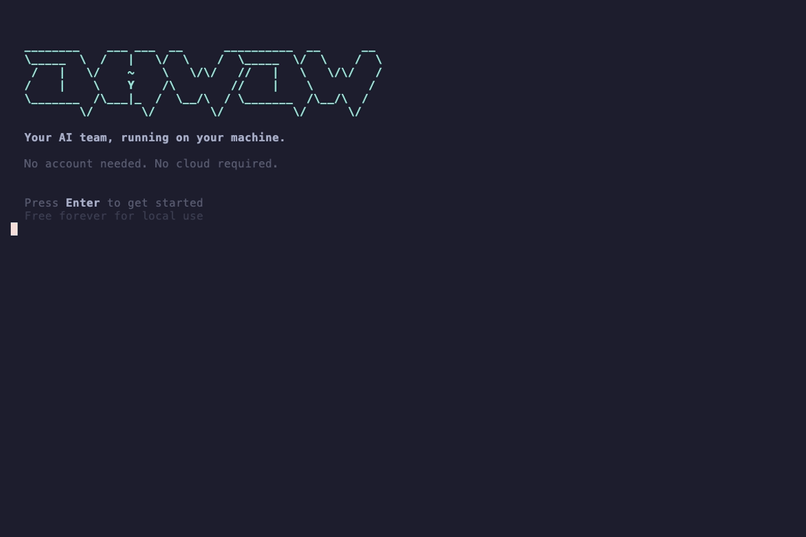

# ohwow

[](LICENSE)
[](https://www.npmjs.com/package/ohwow)
[](https://github.com/ohwow-fun/ohwow/actions/workflows/ci.yml)
[](https://www.npmjs.com/package/ohwow)
[](https://discord.gg/WUGnGqceeY)

**Your AI team that runs on your laptop. Agents that learn, message customers, browse the web, and control your desktop. Costs $0.**

<p align="center">
  
</p>

ohwow is an open source AI business operating system. A team of AI agents that live on your laptop, handle your CRM, message your customers on WhatsApp, automate your workflows, browse the web, and now control your desktop. All running locally. All free. No cloud required.

## Quick Start

```bash
npm install ohwow -g
ohwow
```

A setup wizard walks you through connecting to [Ollama](https://ollama.com), picking a model, and selecting agents for your business type. Running in under 5 minutes.

<p align="center">
  
</p>

## Talk to it like a person

The orchestrator is a conversational assistant with 150+ tools. Open the Chat tab and speak naturally:

| What you say | What happens |
|---|---|
| "Run the content writer on this week's blog post" | Dispatches a task to that agent immediately |
| "What failed today?" | Lists recent failed tasks with details |
| "Schedule outreach every weekday at 9am" | Creates a cron schedule for the agent |
| "Send a WhatsApp to the team: launching Friday" | Sends the message through your connected WhatsApp |
| "Open Figma and export the hero banner as PNG" | Takes over your desktop, opens the app, clicks through menus, saves the file |
| "Plan out researching 5 new leads this week" | Creates a multi-step plan with agent assignments, waits for your approval |
| "Show me the business pulse" | Returns task stats, contact pipeline, costs, and streaks |
| "Create a project for the website redesign" | Creates a project with a Kanban board |

## Features

| Category | What you get |
|---|---|
| AI Agents | 48 pre-built agents across 6 business types, persistent memory, RAG retrieval |
| Orchestrator | 150+ tools, natural language chat interface for everything |
| Desktop Control | Full macOS desktop automation: mouse, keyboard, screen capture. Your agents operate any app on your computer. (macOS only) |
| Messaging | WhatsApp + Telegram built in, auto-routing to agents |
| Browser | Local Chromium automation (navigate, click, fill, screenshot, extract) |
| Voice | Local STT/TTS (Whisper, Piper) with cloud fallbacks |
| CRM | Contacts, pipeline, events, analytics, all stored locally |
| Scheduling | Cron schedules + proactive nudge engine every 30 minutes |
| Workflows | DAG-based multi-agent execution graphs with conditions |
| Multidevice | Zero-config mDNS mesh, automatic task routing across machines |
| MCP | External tool integration via Model Context Protocol |
| A2A | Google Agent-to-Agent protocol over JSON-RPC 2.0 |
| Sandbox | Isolated JavaScript execution (no fs/net/process access) |

## Desktop Control

Your agents aren't trapped inside a chat window. They can use your computer.

ohwow agents see your screen, move the mouse, type on the keyboard, and operate any macOS app. Not through brittle scripts or accessibility hacks. They look at what's on screen, reason about what to do next, and act. The same way you would, but without getting distracted.

**How it works:** the agent takes a screenshot, analyzes it with a vision model, decides the next action (click, type, scroll, key press), executes it, then takes another screenshot to see the result. This perception/reasoning/action loop repeats until the task is done.

```
You: "Fill out the Q1 expense report in Google Sheets using last month's receipts folder"

ohwow:
  1. Opens Finder, navigates to the receipts folder
  2. Opens Google Sheets in Chrome
  3. Reads each receipt, types the amounts into the right cells
  4. Double-checks totals
  5. Done. You were making coffee the whole time.
```

**Safety first.** Desktop control requires your explicit permission before activating. You can stop the agent at any point. Dangerous actions (typing in Terminal, changing system settings) trigger additional approval. An emergency stop halts everything instantly.

**Works with Dispatch.** Connect to [ohwow.fun](https://ohwow.fun) and trigger desktop tasks from your phone. Start a task on the train, your MacBook at home does the work. Check progress from the dashboard.

> Desktop control currently supports macOS only. All other features (agents, chat, browser automation, voice, CRM, scheduling, MCP) work on macOS, Linux, and Windows. See [Windows Setup Guide](docs/windows-setup.md) for details.

## Who is this for?

- **Solo founders** automating marketing, outreach, and ops with zero budget
- **Busy operators** who want an AI team that handles the repetitive screen work while they focus on growth
- **Small teams** that need agents coordinating across devices
- **Agencies** managing operations for multiple clients
- **Privacy-conscious businesses** that need AI automation without cloud lock-in
- **Developers** building custom agents with the orchestrator, MCP tools, and desktop control APIs

## Why ohwow?

| | Zapier | n8n | Make | OpenClaw | **ohwow** |
|---|---|---|---|---|---|
| Runs on your machine | No | Self-host option | No | Yes | **Yes, always** |
| Desktop control | No | No | No | Yes | **Yes, with safety guards** |
| AI agents with persistent memory | No | Yes (LangChain nodes) | No | Partial | **Yes, agents learn over time** |
| Cost to start | $20+/mo | Free (self-host) | $10+/mo | Free | **$0 with Ollama** |
| Pre-built business agents | No | No | No | No | **48 agents, 6 biz types** |
| WhatsApp + Telegram | Plugin | Plugin | Plugin | No | **Built in** |
| CRM + contacts | No | No | No | No | **Built in** |
| Multi-device mesh | No | No | No | No | **Zero-config** |
| Browser automation | No | Partial | No | Yes | **Built in (Chromium)** |
| Workflow DAGs | Yes | Yes | Yes | No | **Yes, with conditions + parallel** |
| Phone dispatch | No | No | No | No | **Yes, via ohwow.fun** |
| Your data stays local | No | Optional | No | Yes | **Always** |

> Comparison as of March 2026. We love what OpenClaw, n8n, and others are building. ohwow focuses on a different problem: a complete AI business runtime, not just a single agent or workflow tool.

## Self-hosting

| Command | What it does |
|---|---|
| `ohwow` | Start the TUI (default) |
| `ohwow --daemon` | Start daemon in foreground (for systemd/launchd/Docker) |
| `ohwow stop` | Stop the daemon |
| `ohwow status` | Check daemon status (PID and port) |
| `ohwow logs` | Tail daemon logs |
| `ohwow restart` | Restart the daemon |

The runtime serves a web UI at `http://localhost:7700`. Override the port with `OHWOW_PORT`.

Docker:

```bash
docker run -d --name ohwow -p 7700:7700 -v ~/.ohwow:/root/.ohwow ohwow
```

## Cloud

Connect to [ohwow.fun](https://ohwow.fun) for cloud features on top of the free local runtime:

- **Desktop dispatch** from your phone. Assign tasks to your MacBook while you're out.
- **OAuth integrations** (Gmail, Slack, and more)
- **Cloud task dispatch** from the web dashboard or mobile
- **AI site generator** with hosting and custom domains
- **Webhook relay** for external services
- **Fleet management** across devices

All local features work without cloud. See [pricing](https://ohwow.fun/pricing) for plans starting at $29/mo.

## Requirements

- Node.js 20+
- [Ollama](https://ollama.com) for local models
- Optional: Anthropic API key (for Claude models)
- Optional: Playwright browsers (`npx playwright install chromium`) for browser automation
- Optional: macOS Accessibility permission for desktop control (macOS only)
- Optional: Visual Studio C++ Build Tools on Windows for `better-sqlite3` native module

## Troubleshooting

| Problem | Solution |
|---------|----------|
| `better-sqlite3` build fails | Install build tools: `xcode-select --install` (macOS), `sudo apt install build-essential python3` (Linux), or Visual Studio C++ Build Tools (Windows) |
| Ollama not detected | Ensure Ollama is running (`ollama serve`) and accessible at `http://localhost:11434` |
| Port 7700 in use | Set `OHWOW_PORT=7701` or any free port |
| WhatsApp QR expired | Restart ohwow and scan the new QR within 60 seconds |
| `EACCES` on global install | Use `npm install ohwow -g --prefix ~/.npm-global` or fix npm permissions |

## Community

- [Discord](https://discord.gg/WUGnGqceeY)
- [Contributing](./CONTRIBUTING.md)
- [Architecture](./ARCHITECTURE.md)
- [Security](./SECURITY.md)
- [Governance](./GOVERNANCE.md)
- Email: ogsus@ohwow.fun

## License

[MIT](./LICENSE)
