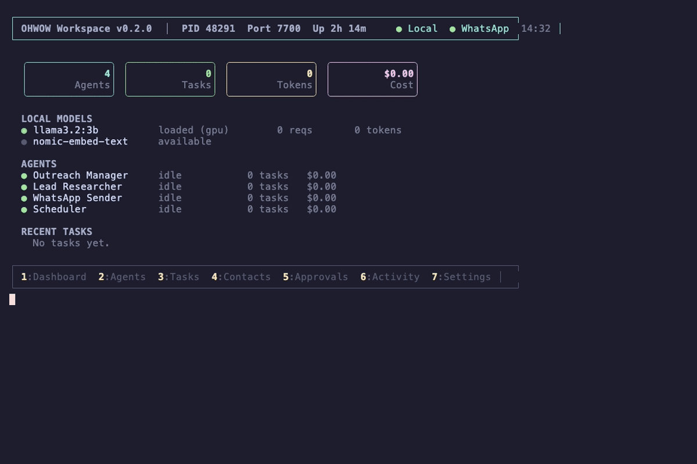

# ohwow

[](LICENSE)
[](https://www.npmjs.com/package/ohwow)
[](https://github.com/ohwow-fun/ohwow/actions/workflows/ci.yml)
[](https://www.npmjs.com/package/ohwow)
[](https://discord.gg/WUGnGqceeY)

**The open source human+AI operating system.** Your computer learns how you work, assembles a team of AI agents around you, and runs your business alongside you. Not for you. With you.

**Local. Free. Yours.**

<p align="center">
  
</p>

```bash
npm install ohwow -g
ohwow
```

Running in under 5 minutes. A setup wizard connects to [Ollama](https://ollama.com), picks a model, and builds an AI team for your business type.

---

## Built for permanence

ohwow was designed as the operating system for a digital life that keeps running — not just while you're at the keyboard, but when you're busy, when you're away, when you're gone. The [Eternal Systems framework](docs/eternal-systems.md) is the philosophy behind why ohwow is built the way it is: local-first so no vendor can take it away, open-source so it can be restarted by anyone who finds it, and architecturally autonomous so your agents carry your values even when you're not there to guide them.

---

## Introducing Vibe Working

Vibe coding changed how we build software. You describe what you want, AI writes the code.

**Vibe working is the same leap, but for everything else.** Describe what your business needs. AI agents handle the sales, support, research, content, operations. You stay in the flow of the work that actually matters to you.

This isn't automation. Automation is rigid. You build a workflow, it runs the same way forever, it breaks when anything changes. Vibe working is fluid. Your agents learn your patterns, adapt to your business stage, understand when to act and when to ask. They get better every day. They develop real expertise from practice, not from prompts.

Under the hood, ohwow is built on a seven-layer cognitive architecture. Not seven microservices. Seven layers of how intelligence actually works: perception, reasoning, memory, embodiment, purpose, identity, and collaboration.

Your agents don't just execute tasks. They perceive your intent and anticipate what you might need next. They challenge their own plans before acting, catching bad ideas before they cost you time. They predict which tools are likely to fail based on past experience, and route around problems before they happen. They track trust the way humans actually do: one failure weighs more than five successes. They detect your energy cycles, know when you're overloaded, and hold complex decisions until you're sharp enough to make them. They understand that a business at $1K/month needs fundamentally different work than one at $100K.

And they have bodies. Not just chat interfaces. ohwow agents can see your screen, control your desktop, click through apps, fill out forms, export files from Figma, pull reports from dashboards. They send WhatsApp messages from your real number, not an API. They browse the web with a real browser, not a scraper. The architecture is ready for physical bodies too: Arduino sensors, ESP32 controllers, temperature monitors, hardware feedback loops with sub-10ms reflexes. A digital brain that can reach into the physical world.

Your devices become one organism. ohwow discovers every machine on your network automatically, no configuration. Your MacBook, your Mac Mini, your home server. They share discoveries: when one device learns that a tool fails in a specific way, every device knows. Work routes to the best machine for the job. If one goes offline, another picks up seamlessly.

This isn't a prompt chain. It's a system that reasons about work the way a great collaborator would, with hands that can actually do things in the world.

The difference:

| | Traditional Automation | Vibe Working |
|---|---|---|
| Setup | Build complex workflows | Say what you need |
| Adaptability | Breaks when context changes | Learns and adjusts |
| Intelligence | If/then rules | Practical wisdom about your business |
| Trust | All or nothing | Earned incrementally, per domain |
| Human awareness | None | Knows your energy, rhythm, capacity |
| Ownership | Cloud vendor controls your data | Runs on your machine |

## Why this matters now

Three things converged to make this possible:

1. **Local models got good enough.** Ollama runs capable models on a laptop. No API costs. No data leaving your machine. ohwow routes simple tasks to local models and complex ones to cloud APIs, only when you allow it.

2. **AI agents can actually do things now.** Not just chat. Browse the web. Control your desktop. Send WhatsApp messages from your real number. Read emails. Update your CRM. 150+ tools, orchestrated by a single brain that understands context.

3. **The missing piece was collaboration, not capability.** Every AI platform asks "how do we make AI do more?" ohwow asks "how do we make humans and AI work together naturally?" That means understanding your energy cycles, respecting your boundaries, earning trust gradually, and knowing when to act vs. when to wait.

## A day of vibe working

**7:45 AM** — You open your laptop. ohwow noticed you always start around this time. Your morning briefing is ready: 3 tasks completed overnight. 1 needs your eye. 2 leads replied to yesterday's outreach. Your Sales Agent's follow-up is queued for 9am.

**8:00 AM** — You say: "What should I focus on today?" ohwow knows you're in growth stage 2 (Attract). It responds: "You're over-indexing on content this week. Your stage needs more outreach. 3 warm leads haven't been contacted. Want me to draft follow-ups?"

**8:15 AM** — You approve the follow-ups. The Sales Agent sends personalized WhatsApp messages to each lead, referencing their specific context from your CRM. No templates. Each message reads like you wrote it.

**10:30 AM** — You're deep in product work. A customer emails with a support question. ohwow routes it to the Support Agent, which drafts a response. Because your cognitive load is high (3 open approvals, deep work mode), it batches the notification instead of interrupting. You'll see it at your next natural break.

**2:00 PM** — ohwow notices your energy dips after lunch (it learned this from 30 days of watching your activity patterns). It holds the complex research report, knowing you'll evaluate it better in the morning. Instead, it surfaces a simple approval that takes 10 seconds.

**4:00 PM** — A lead responds positively on WhatsApp. The Sales Agent wants to send a pricing proposal. It could auto-send (it earned that trust after 47 successful tasks with 94% approval), but the amount is above the auto-approve threshold. You get a one-line notification: "Ready to send pricing to Acme Corp. $4,500/mo. Approve?"

**6:15 PM** — You close your laptop. ohwow stops all non-critical notifications. Your agents keep working: the Content Writer drafts tomorrow's blog post, the Researcher compiles a competitive analysis. Results will be waiting tomorrow morning.

**End of day**: 12 tasks completed across 4 agents. 3 leads contacted. 1 support ticket resolved. 1 blog draft ready. You spent 20 minutes on approvals. The rest was your work.

That's vibe working. You set the direction. Your AI team handles the rest.

---

## How it actually works

### Talk to it like a person

The orchestrator understands natural language with 150+ tools behind it:

| What you say | What happens |
|---|---|
| "Follow up with everyone who opened my last email" | Finds contacts with email opens, drafts personalized follow-ups, sends via WhatsApp or email |
| "Research our top 5 competitors and create a comparison" | Launches the Research Agent with deep web search, compiles findings into a structured report |
| "Schedule outreach every weekday at 9am" | Creates a recurring schedule. The agent picks leads from your CRM, personalizes messages, and sends them on time |
| "Open Figma and export the hero banner as PNG" | Takes over your desktop, opens the app, navigates to the file, exports it, saves to your folder |
| "How's the business doing?" | Shows your eudaimonia score (workspace flourishing), task stats, lead pipeline, agent efficiency, and growth stage guidance |
| "Create a project for the website redesign" | Creates a Kanban board, suggests task breakdown, assigns agents to each phase |
| "Send a WhatsApp to the team: launching Friday" | Sends through your connected WhatsApp. No API needed. Uses your actual WhatsApp number |
| "What should I focus on this week?" | Analyzes your growth stage, current work balance, goal velocity, and team capacity. Gives specific, actionable recommendations |

### Your agents learn and improve

ohwow agents aren't stateless. They remember what worked and what didn't:

- After the Content Writer produces 50 blog posts, it knows your brand voice, preferred structure, and which topics get approved immediately vs revised
- After the Sales Agent sends 200 outreach messages, it knows which opening lines get responses and which get ignored
- After the Researcher completes 30 deep dives, it knows which sources you trust and how detailed you want the analysis

This isn't "fine-tuning." It's persistent memory, skill synthesis, and pattern mining that builds real expertise over time. Each agent develops its own character: some become meticulous researchers, others become fast-moving closers.

### It knows your business stage

A startup just launching needs different work than an established company scaling. ohwow knows the difference:

| Growth Stage | Revenue | What ohwow prioritizes |
|---|---|---|
| **Launch** | $0-$1K | Selling. Not building more features. Not researching competitors. Getting first customers |
| **Attract** | $1K-$10K | Lead flow. Content that brings people in. One channel, mastered |
| **Systemize** | $10K-$25K | Automating what works. SOPs. Reducing founder dependency |
| **Focus** | $25K-$50K | Cutting the bottom 20%. Serving ideal customers. Unit economics |
| **Expand** | $50K-$100K | Second product or market. Validated before scaled |
| **Structure** | $250K-$500K | Delegation. The founder stops doing execution work |

When you ask "what should I focus on?", the answer comes from practical wisdom about your specific stage, not generic advice.

### It respects that you're human

Most productivity tools treat you like a machine that processes tasks. ohwow doesn't.

- **It learns your rhythm.** Morning person? Complex approvals arrive at 9am. Afternoon slump? Only quick tasks surface after 2pm.
- **It detects overload.** When you have too many open decisions, it stops adding work and starts batching, prioritizing, and filtering.
- **It respects boundaries.** If you always stop responding at 6pm, ohwow stops notifying. No setting required. It learns by watching.
- **It suggests rest.** After a week of sprinting, it shifts work toward reflective tasks and away from high-pressure action items.

---

## Real scenarios

### For a solo e-commerce founder

You sell handmade candles on Shopify. You spend 3 hours a day on customer emails, social media, and supplier follow-ups.

With ohwow: the Support Agent handles customer questions via WhatsApp (you approve the first few, then trust builds and it handles most autonomously). The Content Writer creates daily Instagram captions and weekly blog posts about your craft. The Sales Agent follows up with wholesale leads from your last trade show. You focus on making candles.

### For a SaaS founder with a small team

You and 2 engineers are building a developer tool. Marketing, support, and sales fall on you.

With ohwow: agents handle lead outreach, support ticket triage, competitive research, and content creation. The system knows you're at stage 2 (Attract) and pushes outreach over feature building. When a lead responds on WhatsApp, the Sales Agent drafts a response referencing their specific use case from your CRM. Your team reviews agent output in the dashboard. Trust builds per domain: the Content Writer runs autonomously, the Sales Agent still needs approval for pricing discussions.

### For an agency managing multiple clients

You run a marketing agency with 10 clients. Each needs weekly reports, social posts, and campaign analysis.

With ohwow: each client gets dedicated agents. The Researcher pulls analytics. The Content Writer drafts social posts in each client's brand voice. The Reporter compiles weekly performance reports. Agents learn each client's preferences separately. Desktop automation exports graphics from Canva, screenshots from analytics dashboards. Multi-device mesh lets your office Mac Mini run overnight while you review results on your MacBook in the morning.

### For a privacy-focused business

You handle sensitive customer data and can't use cloud AI platforms.

With ohwow: everything runs locally with Ollama. No data leaves your machine. No API calls to external LLMs if you don't want them. Local SQLite database. Local model inference. WhatsApp messages stay on your device. You get full AI automation with zero cloud dependency.

---

## Features

| Category | What you get |
|---|---|
| **AI Agents** | 48 pre-built agents across 6 business types. Persistent memory. Tool mastery. Real expertise over time |
| **Orchestrator** | 150+ tools. Natural language interface. Growth-stage-aware recommendations |
| **Desktop Control** | Full macOS automation: mouse, keyboard, screen capture. Your agents operate any app on your computer |
| **Messaging** | WhatsApp + Telegram built in. Uses your real number. Auto-routing to the right agent |
| **Browser** | Local Chromium automation: navigate, click, fill forms, screenshot, extract data |
| **CRM** | Contacts, pipeline, events, analytics. All stored locally. Agents use it to personalize outreach |
| **Scheduling** | Cron schedules + smart timing based on opportunity detection |
| **Workflows** | Multi-step automation graphs. Parallel execution. Conditions and branching |
| **Multi-device** | Zero-config mesh across your machines. Tasks route to the best device. Self-healing if one goes down |
| **Physical I/O** | Connect Arduino, ESP32, sensors, actuators. Your office becomes smart |
| **MCP** | External tool integration via Model Context Protocol |
| **A2A** | Agent-to-Agent protocol for connecting with other AI systems |
| **Cognitive Architecture** | 7-layer philosophical system powering everything under the hood |

## Use with Claude Code

ohwow works as a Claude Code plugin. 25 tools become available in your Claude conversations.

```bash
claude plugin install ohwow-fun/ohwow
```

Or add to any project's `.mcp.json`:

```json
{
  "mcpServers": {
    "ohwow": {
      "command": "npx",
      "args": ["-y", "ohwow", "mcp-server"]
    }
  }
}
```

**Example**: "Research the top 5 competitors in our space, add the findings to the knowledge base, then create a contact for each CEO." Claude uses ohwow's research, knowledge, and CRM tools seamlessly.

### Use Claude Code as Your AI Provider

If you have Claude Code installed and authenticated, ohwow can use it as the AI backend for all agent tasks. No API key needed.

```bash
# Via environment variable
OHWOW_MODEL_SOURCE=claude-code npx ohwow

# Or press Ctrl+O in the dashboard and select "Claude Code"
```

This routes all model calls through `claude --print`, using your existing Claude subscription. Two modes work together:

- **Provider mode** (`modelSource: claude-code`): single-turn completions for orchestrator chat, memory extraction, planning
- **Full delegation** (`modelSource: claude-code-cli`): entire tasks delegated to Claude Code with its own tool loop

## If You Already Use AI Agents

You probably already have an AI assistant with memory, tool use, and web browsing. ChatGPT remembers things about you. Claude Code edits your files. Gemini searches the web. They're good. So why would you also want ohwow?

Because there's a gap between "AI that can answer questions and use tools" and "AI that actually runs part of your business." That gap is what ohwow fills.

**Your agent's memory is rented.** ChatGPT's memory lives on OpenAI's servers. Claude's lives on Anthropic's. If you switch providers, cancel a subscription, or the service changes its terms, your agent's learned context disappears. ohwow stores everything in SQLite on your machine. Your agent's memory, skills, identity, and full task history belong to you. Back it up, fork it, migrate it. No vendor can take it away.

**Your agent is locked to one provider.** A Custom GPT only runs on OpenAI. A Claude project only runs on Anthropic. ohwow's model router runs any model from any provider through the same persistent body. Use Llama locally for simple tasks, Claude for complex reasoning, GPT for specific workflows. Switch models without losing a single memory, skill, or learned pattern. Your agent's intelligence accumulates regardless of which brain is powering it today.

**Your agent doesn't learn from its own work.** ChatGPT remembers facts you tell it. ohwow agents learn from execution. After 200 outreach messages, the Sales Agent knows which opening lines get responses. After 50 support tickets, the Support Agent knows which issues it can resolve alone. This isn't prompt engineering. It's skill synthesis from real outcomes: Thompson sampling routes tasks to the agent most likely to succeed, strategic principles emerge from patterns in what worked, and practice sessions let agents rehearse before doing.

**Your agent doesn't self-regulate.** When a tool starts failing silently, your current agent doesn't notice. ohwow runs homeostatic control loops that detect drift in error rates, throughput, and cognitive load, then trigger corrective action automatically. An immune system learns threat signatures and escalates alert levels. Somatic markers tag tool outcomes with emotional valence, so the agent develops intuition: not just "this failed once" but "this approach in this context feels wrong."

**Your agent waits to be asked.** It doesn't notice that your lead pipeline is drying up, or that a task it completed yesterday created a follow-up opportunity, or that Tuesday mornings are when you're sharpest for strategic decisions. ohwow's BIOS layer learns your circadian rhythm from activity patterns, estimates cognitive load in real time, and uses that to act at the right moment. It surfaces the competitive analysis when you're sharp enough to make decisions on it. It notices a lead went cold and drafts a follow-up before you think to ask. It detects that you've been sprinting all week and shifts toward reflective work. The goal isn't fewer interruptions. It's an agent that reads the room and moves first.

**Your agent works alone.** ohwow agents coordinate. A multi-device mesh shares discoveries across your machines with zero configuration. When one device learns something, every peer knows. Tasks route to the best device. If one goes offline, another picks up. Agents delegate to each other via the A2A protocol, with trust earned per domain, not granted all at once.

None of this replaces your existing AI tools. It gives them a persistent, self-improving, provider-independent body that's yours to keep.

```bash
npm install ohwow -g && ohwow
```

## Desktop Control

Your agents aren't trapped in a chat window. They operate your computer.

```
You: "Fill out the Q1 expense report in Google Sheets using last month's receipts folder"

ohwow:
  1. Opens Finder, navigates to receipts
  2. Opens Google Sheets in Chrome
  3. Reads each receipt, types amounts into the right cells
  4. Double-checks totals
  5. Done. You were making coffee the whole time.
```

The agent takes a screenshot, analyzes it with a vision model, decides the next action, executes it, then screenshots again to see the result. This perception/reasoning/action loop repeats until the task is done.

**Safety first.** Desktop control requires explicit permission. Emergency stop halts everything instantly. Dangerous actions (Terminal, system settings) trigger additional approval.

## Multi-device Mesh

```
Mac Mini (home office)       MacBook (on the go)          Raspberry Pi (warehouse)
┌────────────────┐          ┌────────────────┐          ┌────────────────┐
│ WhatsApp Agent  │◄─mesh──►│ Research Agent  │◄─mesh──►│ Temp Sensor     │
│ Desktop Tasks   │          │ Browser Auto    │          │ Motion Detect   │
│ Overnight Work  │          │ Mobile Review   │          │ Inventory Scan  │
└────────────────┘          └────────────────┘          └────────────────┘
```

Zero configuration. Devices discover each other on your network. Tasks go to the best device for the job. If your Mac Mini discovers that a lead's website is down, your MacBook knows instantly. If one device goes offline, another takes over its responsibilities.

## Why ohwow?

| | Zapier | n8n | Make | **ohwow** |
|---|---|---|---|---|
| Runs on your machine | No | Self-host option | No | **Yes, always** |
| Desktop control | No | No | No | **Yes, with safety guards** |
| AI agents with real memory | No | Partial | No | **Yes, agents build expertise** |
| Cost to start | $20+/mo | Free (self-host) | $10+/mo | **$0 with Ollama** |
| Pre-built business agents | No | No | No | **48 agents, 6 business types** |
| WhatsApp + Telegram | Plugin | Plugin | Plugin | **Built in** |
| CRM + contacts | No | No | No | **Built in** |
| Multi-device mesh | No | No | No | **Zero-config** |
| Knows your growth stage | No | No | No | **Yes, adapts priorities** |
| Respects your energy/stress | No | No | No | **Yes, bio-aware** |
| Your data stays local | No | Optional | No | **Always** |

## Cloud (optional)

Connect to [ohwow.fun](https://ohwow.fun) for cloud features on top of the free local runtime:

- **Phone dispatch**: assign tasks to your computer from your phone
- **OAuth integrations**: Gmail, Slack, and more
- **AI site generator**: with hosting and custom domains
- **Fleet dashboard**: manage all your devices from one place
- **Collective intelligence**: visualize what your agents have learned
- **Work ontology dashboard**: eudaimonia score, growth stage guidance

All local features work without cloud. See [pricing](https://ohwow.fun/pricing) for plans starting at $29/mo.

## Under the Hood

For those who want to understand the architecture: ohwow is built on a seven-layer philosophical cognitive architecture. Each layer addresses a distinct dimension of intelligence, grounded in philosophy from Aristotle to modern cognitive science.

```
Layer 7: BIOS       — Respects human biology (energy, stress, boundaries)
Layer 6: Symbiosis  — Models human-AI collaboration (trust, handoffs, mutual learning)
Layer 5: Soul       — Tracks identity for agents and humans (values, blind spots, growth)
    Persona         — Real-time behavioral profiling (circadian, load, communication style)
Layer 4: Mesh       — Distributed consciousness across devices (propagation, shared body, self-healing)
Layer 3: Work       — Purpose-driven execution (growth stage wisdom, work classification, flourishing)
Layer 2: Body       — Physical + digital embodiment (organs, nervous systems, affordances, PID controllers)
Layer 1: Brain      — Cognitive cycle: perceive → deliberate → act (prediction, reflection, dialectic)
Layer 0: Runtime    — Orchestrator, engine, 150+ tools, DB, API, scheduling, messaging
```

115+ modules. 28,000+ lines. Every philosophical concept is load-bearing architecture: remove any one and the system degrades measurably. See [ARCHITECTURE.md](./ARCHITECTURE.md) for the full technical breakdown.

## Self-hosting

| Command | What it does |
|---|---|
| `ohwow` | Start the TUI (default) |
| `ohwow --daemon` | Start daemon in foreground (for systemd/launchd/Docker) |
| `ohwow stop` | Stop the daemon |
| `ohwow status` | Check daemon status |
| `ohwow logs` | Tail daemon logs |

Docker:

```bash
docker run -d --name ohwow -p 7700:7700 -v ~/.ohwow:/root/.ohwow ohwow
```

## Requirements

- Node.js 20+
- [Ollama](https://ollama.com) for local models
- Optional: Anthropic API key (for Claude models)
- Optional: Playwright browsers (`npx playwright install chromium`) for browser automation
- Optional: macOS Accessibility permission for desktop control

## Troubleshooting

| Problem | Solution |
|---------|----------|
| `better-sqlite3` build fails | Install build tools: `xcode-select --install` (macOS), `sudo apt install build-essential python3` (Linux) |
| Ollama not detected | Ensure Ollama is running (`ollama serve`) and accessible at `http://localhost:11434` |
| Port 7700 in use | Set `OHWOW_PORT=7701` or any free port |
| WhatsApp QR expired | Restart ohwow and scan the new QR within 60 seconds |

## Community

- [Discord](https://discord.gg/WUGnGqceeY)
- [Contributing](./CONTRIBUTING.md)
- [Architecture](./ARCHITECTURE.md)
- [Security](./SECURITY.md)
- Email: ogsus@ohwow.fun

## License

[MIT](./LICENSE)
